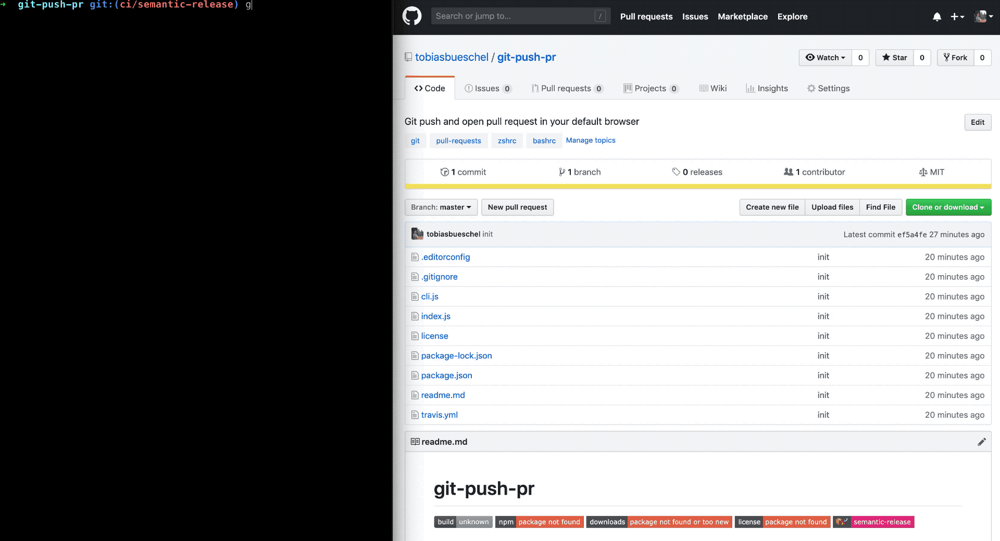

# git-push-pr

[](http://npm.im/git-push-pr)
[](http://npm-stat.com/charts.html?package=git-push-pr)
[](http://opensource.org/licenses/MIT)
[](https://github.com/semantic-release/semantic-release)

> Git push and automatically open pull request in your default browser (works for GitHub, GitLab and Bitbucket)



## Install

```shell
npm install --global git-push-pr
```

## Usage

```shell
gppr --help

  Usage
    gppr [options]

  Options
    --remote, -r Specify remote name [Default: origin]
    --allow-all, -a Allow pushes to main, master and develop
    --silent, -s Do not show any progress
    --force, -f Push changes even if remote is newer, use with caution
    --no-verify Bypass pre-push hooks

  Examples
    $ gppr -f
```

## Related

- [git-is-branch-protected-cli](https://github.com/tobiasbueschel/git-is-branch-protected-cli) - CLI to check whether current Git branch is protected.

## License

MIT © [Tobias Büschel](https://github.com/tobiasbueschel)
